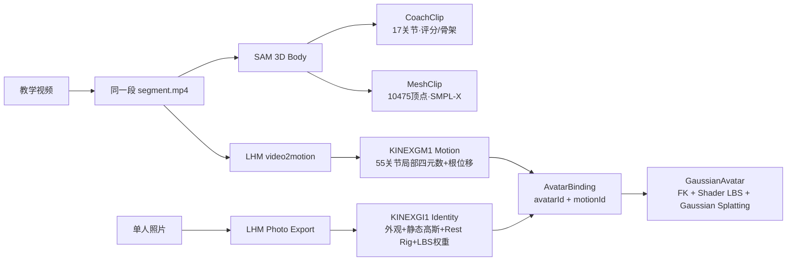
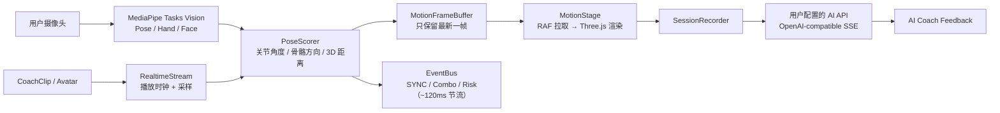

# KINE//X

[](#)

[](https://www.typescriptlang.org/)
[](https://threejs.org/)
[](https://developers.google.com/mediapipe)
[](https://fastapi.tiangolo.com/)
[](https://github.com/facebookresearch/sam)
[](#)

**KINE//X 把"运动短视频"变成"可计算的 3D 私教"。**

导入一段动作视频，系统重建出 3D 骨骼与网格教练；上传一张全身照，LHM 一次前馈生成可复用的 3DGS 数字分身；练习者打开摄像头，浏览器端实时比对姿态、逐关节打分并提示风险；训练结束后，AI 教练生成可追问的中文复盘报告。

**让任何一段运动短视频，都能变成一个看得见你、评得出分、说得出错的交互式教练。**

## Demo

https://github.com/user-attachments/assets/0af4a441-1f89-4098-bfad-cf1c84208f2f

> 完整闭环现场演示：导入视频 → 生成 3D 教练 → 绑定数字分身 → 摄像头跟练 → 实时评分 → 结算复盘 → AI 教练反馈。前端完全离线可用。

## 解决什么问题

运动教学、健身跟练、运动类 UGC 二次消费这三个场景，共享同一个断点：

- **运动视频"只能看"** —— 你对着视频跟练，视频看不见你：做得对不对、哪个关节偏了、有没有受伤风险，全都没有答案。内容是单向的，反馈是零。
- **专业动作难以拆解** —— 教练示范节奏快、视角固定，无法旋转观察、慢放、逐帧比对，抠细节只能反复拖进度条。
- **3D 数字人生产成本高** —— 传统动捕 + 建模流程，把"拥有一个会动的数字分身"锁在专业团队手里，普通创作者和中小机构够不着。

## 为谁而建

| 目标用户 | 核心诉求 | KINE//X 对应能力 |
| --- | --- | --- |
| 居家健身与运动爱好者 | 跟练时获得即时纠错与量化反馈，而不是"盲练" | 摄像头实时评分、关节级风险提示、训练报告与 AI 复盘 |
| 运动教学者 / 教练 / 培训机构 | 把示范视频升级为可交互课件，降低讲解成本 | 视频导入即生成 3D 教练，支持旋转观察、慢放拆解、逐帧比对 |
| 运动内容创作者 / UGC 博主 | 让内容"动起来"，低成本拥有数字分身 | 一张全身照生成 3DGS 数字分身，可跨动作复用 |

## AI 在链路里做了什么

AI 分布在五个环节，形成「**内容理解 → 3D 重建 → 数字分身 → 实时评估 → 赛后复盘**」的完整 workflow：

| 环节 | AI 能力 | 具体在做什么 |
| --- | --- | --- |
| 1. 视频内容理解 | 多模态大模型（MLLM） | 按 1.5s 间隔采样关键帧，判断有效动作起止区间并给出可选片段——自动"切片"，省去手拖时间轴 |
| 2. 3D 动作重建 | SAM 3D Body（SMPL-X） | 对切片逐帧推理，把 2D 人体重建为 SMPL-X 网格与骨骼序列，打包为 CoachClip（骨骼轨迹）与 MeshClip（网格动画） |
| 3. 数字分身生成 | LHM + 3D Gaussian Splatting | 一张全身照一次重建为 3DGS 身份（静态高斯 + 55 关节 Rest 骨架 + LBS 权重）；身份与动作解耦、幂等绑定，运行时现场组合 |
| 4. 实时感知与评估 | MediaPipe Pose/Hand/Face + 评分求解器 | 浏览器端三模态关键点检测；站姿标定还原米制尺度，按关节角度差、骨骼方向、3D 距离逐帧加权打分；滑动窗口容忍"慢半拍"，偏差超阈值直接标红风险关节 |
| 5. 赛后 AI 教练 | LLM（流式对话） | 训练摘要 → 中文诊断（量化误差 + 可执行建议），支持多轮追问；区分"测量事实"与"生物力学推断"，涉及疼痛损伤会提醒停止训练并寻求专业评估 |

两条链路设计原则：

- **重模型一次性离线推理，浏览器只做轻量实时感知。** SAM 与 LHM 的重推理在后端对每段内容只做一次，产物是结构化资产；浏览器端不需要 GPU，靠 MediaPipe 与评分求解器即可维持 30–60fps 的实时体验。
- **AI 能力用户自有（BYOK）。** MLLM 与 LLM 均由浏览器直连用户自己配置的 OpenAI-compatible API，密钥只存在浏览器 localStorage，不经过任何服务器——隐私与成本归用户自己，产品不绑定单一模型供应商。

## 3D 重建管线

一段 `segment.mp4` 同时喂给三条生产线：评分骨架、可视化网格、以及可分身穿戴的动作资产。



## 实时训练链路



## 创新点

- **身份 × 动作解耦的可复用 3DGS 数字人** —— 常见做法是"一个人、一套动捕、一个模型"；我们把身份（照片一次重建）与动作（每段视频一次提取）彻底拆开，幂等绑定、运行时现场组合。一张照片即可驾驭任意动作库，数字人内容生产成本是数量级的下降。
- **纯浏览器端的实时评分闭环** —— 无打包器的 vanilla TypeScript + Three.js，MediaPipe 模型与字体全部本地化离线运行；标定、评分、风险检测全在前端完成。30–60fps 不卡，靠的是严格的帧数据隔离：高频骨骼帧只进单帧缓冲、由渲染循环主动拉取，低频 UI 事件走独立事件总线。
- **AI 能力用户自有（BYOK）** —— MLLM 分片与 LLM 教练都直连用户自己的 OpenAI-compatible 端点，天然适配国产模型与私有化部署，产品侧零密钥托管风险。
- **端到端严格数据契约** —— 米制单位、右手坐标系、四元数旋转贯穿前后端，并有工程守卫脚本强制（高频路径禁止欧拉角与响应式状态），为接入真实后端与多人协作预留了稳定接口。

## 技术栈

- **Frontend**：TypeScript，native ES modules，Canvas / Three.js，MediaPipe Tasks Vision —— 无框架、无打包器、无运行时 CDN
- **Motion Runtime**：右手坐标系、米制单位、四元数端到端（slerp 平滑，全程无 Euler）
- **Scoring**：world landmarks、姿态归一化、关节角解算、One-Euro 平滑、历史窗口匹配
- **3D 重建后端**：FastAPI + SAM 3D Body + LHM + ffmpeg，输出 CoachClip / MeshClip / KINEXGI1 / KINEXGM1
- **Avatar 渲染**：55 关节 FK + 顶点着色器 LBS + CPU 深度排序的 Gaussian Splatting
- **AI API**：浏览器直连用户配置的 OpenAI-compatible `/chat/completions`；MLLM 视频分片与赛后分析模型可分别指定
- **Build**：Node `stripTypeScriptTypes` 剥类型即产物，`index.html` 直接加载 `dist/main.js`

## 快速开始

### 1. 启动前端

```bash
npm run dev
# 打开 http://localhost:5173
```

无需任何后端即可完整演示：内置动作种子、离线 MediaPipe、本地 RealtimeStream 兜底。

### 2. 配置自己的 AI API（可选）

在创作工坊点「配置 AI API」，或训练舱右上角「摄像头与 AI 设置」：

- OpenAI-compatible Base URL（可直连 `/chat/completions` 地址）
- API Key
- MLLM 视频切片模型 / 赛后分析模型（分别填写）

配置保存在浏览器 `localStorage`，请求不经过任何 KINE//X 服务器；点击「测试两项连接」可分别验证图片输入 + JSON 模式与 SSE 流式输出。

### 3. 启动 3D 重建后端（可选，视频导入 / 分身生成）

```bash
# 需本机已准备 SAM 3D Body / LHM 模型资产，详见 backend/README.md
PYTHONPATH=/path/to/sam-3d-body:$(pwd) \
python -m uvicorn backend.app:app --host 0.0.0.0 --port 8765
```

核心端点：

| Method | Path | 用途 |
| --- | --- | --- |
| `GET` | `/healthz` | 模型加载状态 |
| `POST` | `/import/video` | 上传视频 → CoachClip / MeshClip（可选 `startSec`/`endSec` 切片、`avatarId` 绑定） |
| `GET\|POST` | `/avatars` | 照片 → 3DGS 身份 |
| `GET\|POST` | `/avatar-bindings` | 身份 × 动作绑定（幂等） |
| `GET` | `/import/jobs` | 已完成导入任务 |

前端默认访问当前 host 的 `:8765`，可用 `?backend=http://localhost:8765` 覆盖。

## 页面与路由

单 DOM 的 hash 路由 SPA——页面切换不重载，MediaPipe、WebSocket 与摄像头流在页面间存活：

| Route | 页面 | 内容 |
| --- | --- | --- |
| `#/` | 动作库 | 种子卡墙、导入入口、最近训练记录 |
| `#/train/:seedId` | 训练舱 | 摄像头跟练主舞台：镜像视频 + 3D 教练/分身 + 实时评分 + 时间轴 |
| `#/report/:sessionId?` | 训练报告 | 总分、关节报告表、阶段均分、AI 教练、历史趋势 |
| `#/create` | 创作工坊 | 视频上传 → MLLM 分片 → SAM3D 重建 → 入库，四步向导 |
| `#/avatars` | 分身身份库 | 照片 → 3DGS 身份：上传、重命名、软删除、环绕预览与姿态预览 |

## 运动数据契约

前后端对齐的核心数据包是 `FRAME_STREAM`：坐标一律为米、右手系，旋转一律为 `[x, y, z, w]` 四元数。

```json
{
  "type": "FRAME_STREAM",
  "data": {
    "frame": 128,
    "timestampMs": 5333,
    "seedId": "squat",
    "progress": 0.42,
    "score": 87,
    "combo": 8,
    "riskLabel": "Guard knee",
    "globalTransform": { "translation": [0, 0, 0], "rotation": [0, 0, 0, 1] },
    "joints": {
      "pelvis": { "position": [0, 0.84, 0.18], "rotation": [0, 0, 0, 1] }
    },
    "metrics": [
      { "id": "knee", "score": 87, "angleDeltaDeg": 8.4, "distanceDeltaCm": 11.2, "risk": "warn" }
    ]
  }
}
```

接入真实帧流后端只需按此契约向 `ws://localhost:8000/motion`（可用 `?ws=` 覆盖）推送 `FRAME_STREAM` 包，前端侧已全部就绪。约束要点：摄像头视频镜像、3D 画布不镜像；高频帧只进 `MotionFrameBuffer`；`MotionStage` 在 RAF 中拉取渲染；切换种子必须释放旧资源。

## 质量检查

```bash
npm run check
```

重新构建 `dist/`，并用守卫脚本强制检查工程不变量：米制单位、右手坐标系、摄像头镜像、RAF 拉取、slerp 平滑、资源释放；禁止 `Euler` / `useState` / `ref(` 进入高频路径；所有构建产物过 `node --check`。

## 项目结构

```text
.
├── index.html                 # 入口，importmap 指向本地 MediaPipe 与 Three.js
├── src/                       # TypeScript 源码（core / components / data / hooks / types）
├── dist/                      # 构建产物（剥类型后的同名 ES modules）
├── public/
│   ├── mediapipe/             # 离线 WASM / task 模型资产
│   ├── three/                 # 本地化 Three.js r160
│   ├── fonts/                 # 本地字体
│   └── coach_clips/           # 预置与导入生成的动作 / 分身资产
├── backend/                   # SAM 3D Body + LHM 重建服务（FastAPI）
├── sam_3d_body/               # SAM / SMPL-X 转换与导出脚本
├── scripts/                   # 构建、guardrail 检查与测试
└── docs/                      # 项目文档与演示资产
```

## 后续延展

- **生产级 WebSocket 帧流服务**：数据契约已预留，接入后即可支撑远程私教、多人同练、直播跟练等实时场景
- **训练计划与课程体系**：基于 Session 历史的多场趋势分析、周期性训练计划与课程编排
- **更宽的动作类目**：评分权重已模板化，可快速扩充舞蹈、武术、康复训练等垂直类目
- **导入链路工程化**：视频重建改为 202 异步任务队列与断点恢复，补齐健康分层与队列观测
- **数据契约开放**：MotionFrame 固化为 OpenAPI / JSON Schema，第三方可接入评分与渲染层，形成生态

---

KINE//X 当前为黑客松原型，已跑通完整闭环：**导入视频 → 生成 3D 教练 → 绑定数字分身 → 摄像头跟练 → 实时评分 → 结算复盘 → AI 教练反馈。**它想证明的一件事：运动视频不必只能"看"——它可以被计算、被比较、被反馈，也可以穿在你的分身上。
