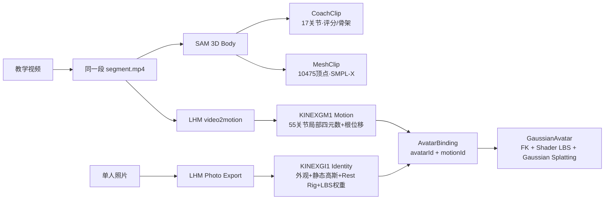
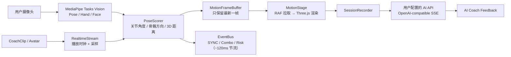

# KINE//X

[](#)

[](https://www.typescriptlang.org/)
[](https://threejs.org/)
[](https://developers.google.com/mediapipe)
[](https://fastapi.tiangolo.com/)
[](https://github.com/facebookresearch/sam)
[](#)

**把一段运动教学视频，变成你的 3D 私人教练。**

上传一段动作视频，KINE//X 用 SAM 3D Body 把它重建成可旋转、可慢放、可逐帧评分的 3D 教练；再上传一张单人照片，LHM 会把它变成一个可复用的 3D 高斯分身（3DGS Avatar），替你把任意动作"穿"在身上演示。打开摄像头，浏览器端实时提取你的姿态，与标准动作逐帧对齐、打分、提示风险关节——训练结束后，AI 教练输出中文复盘。

全部前端跑在浏览器里，零构建依赖、零 CDN、可完全离线。

## Demo

<video src="https://github.com/The0xKa1/KINE-X/raw/main/docs/assets/kinex-demo.mp4" controls muted playsinline width="100%"></video>

> 完整演示流程：视频导入 → 3D 重建 → 分身绑定 → 摄像头跟练 → 实时评分 → AI 复盘。

## 核心亮点

- **视频即教练**：上传 mp4 / webm，SAM 3D Body 后端生成 17 关节 CoachClip（评分 + 骨架）与 10475 顶点 SMPL-X MeshClip，前端直接加载为新的动作种子。
- **照片即分身**：一张单人照片经 LHM 生成 3DGS 身份——外观、静态高斯、55 关节 Rest Rig 与 LBS 权重——身份与动作**解耦**，任意身份可绑定任意动作，在浏览器里以 Gaussian Splatting 实时渲染。
- **浏览器端实时评分**：MediaPipe Pose / Hand / Face 资产全部本地化，摄像头姿态按关节角度、骨骼方向、3D 距离与动作历史窗口匹配，输出同步分、Combo 与风险关节。
- **可交互 3D 舞台**：标准动作在全息舞台播放，支持 front / side / top 视角、拖拽旋转、滚轮缩放与时间轴 scrub；T-pose 标定适配不同身高体型。
- **AI 教练复盘**：训练结束后 SessionSummary 由浏览器直连用户自己配置的 OpenAI-compatible API，流式输出中文动作反馈与追问对话。
- **工程上可演示一整天**：高频帧只进 `MotionFrameBuffer`，渲染由 RAF 主动拉取；低频 UI 走 `EventBus`；四元数端到端，资源释放有守卫脚本强制检查。

## 3D 重建管线

一段 `segment.mp4` 同时喂给三条生产线：评分骨架、可视化网格、以及可分身穿戴的动作数据。



## 实时训练链路



## 技术栈

- **Frontend**：TypeScript，native ES modules，Canvas / Three.js，MediaPipe Tasks Vision —— 无框架、无打包器、无运行时 CDN
- **Motion Runtime**：右手坐标系、米制单位、四元数端到端（slerp 平滑，全程无 Euler）
- **Scoring**：world landmarks、姿态归一化、关节角解算、One-Euro 平滑、历史窗口匹配
- **3D 重建后端**：FastAPI + SAM 3D Body + LHM + ffmpeg，输出 CoachClip / MeshClip / KINEXGI1 / KINEXGM1
- **Avatar 渲染**：55 关节 FK + 顶点着色器 LBS + CPU 深度排序的 Gaussian Splatting
- **AI API**：浏览器直连用户配置的 OpenAI-compatible `/chat/completions`；MLLM 视频分片与赛后分析模型可分别指定
- **Build**：Node `stripTypeScriptTypes` 剥类型即产物，`index.html` 直接加载 `dist/main.js`

## 快速开始

### 1. 启动前端

```bash
npm run dev
# 打开 http://localhost:5173
```

无需任何后端即可完整演示：内置动作种子、离线 MediaPipe、本地 RealtimeStream 兜底。

### 2. 配置自己的 AI API（可选）

在创作工坊点「配置 AI API」，或训练舱右上角「摄像头与 AI 设置」：

- OpenAI-compatible Base URL（可直连 `/chat/completions` 地址）
- API Key
- MLLM 视频切片模型 / 赛后分析模型（分别填写）

配置保存在浏览器 `localStorage`，请求不经过任何 KINE//X 服务器；点击「测试两项连接」可分别验证图片输入 + JSON 模式与 SSE 流式输出。

### 3. 启动 3D 重建后端（可选，视频导入 / 分身生成）

```bash
# 需本机已准备 SAM 3D Body / LHM 模型资产，详见 backend/README.md
PYTHONPATH=/path/to/sam-3d-body:$(pwd) \
python -m uvicorn backend.app:app --host 0.0.0.0 --port 8765
```

核心端点：

| Method | Path | 用途 |
| --- | --- | --- |
| `GET` | `/healthz` | 模型加载状态 |
| `POST` | `/import/video` | 上传视频 → CoachClip / MeshClip（可选 `startSec`/`endSec` 切片、`avatarId` 绑定） |
| `GET\|POST` | `/avatars` | 照片 → 3DGS 身份 |
| `GET\|POST` | `/avatar-bindings` | 身份 × 动作绑定（幂等） |
| `GET` | `/import/jobs` | 已完成导入任务 |

前端默认访问当前 host 的 `:8765`，可用 `?backend=http://localhost:8765` 覆盖。

## 页面与路由

单 DOM 的 hash 路由 SPA——页面切换不重载，MediaPipe、WebSocket 与摄像头流在页面间存活：

| Route | 页面 | 内容 |
| --- | --- | --- |
| `#/` | 动作库 | 种子卡墙、导入入口、最近训练记录 |
| `#/train/:seedId` | 训练舱 | 摄像头跟练主舞台：镜像视频 + 3D 教练/分身 + 实时评分 + 时间轴 |
| `#/report/:sessionId?` | 训练报告 | 总分、关节报告表、阶段均分、AI 教练、历史趋势 |
| `#/create` | 创作工坊 | 视频上传 → MLLM 分片 → SAM3D 重建 → 入库，四步向导 |
| `#/avatars` | 分身身份库 | 照片 → 3DGS 身份：上传、重命名、软删除、环绕预览与姿态预览 |

## 运动数据契约

前后端对齐的核心数据包是 `FRAME_STREAM`：坐标一律为米、右手系，旋转一律为 `[x, y, z, w]` 四元数。

```json
{
  "type": "FRAME_STREAM",
  "data": {
    "frame": 128,
    "timestampMs": 5333,
    "seedId": "squat",
    "progress": 0.42,
    "score": 87,
    "combo": 8,
    "riskLabel": "Guard knee",
    "globalTransform": { "translation": [0, 0, 0], "rotation": [0, 0, 0, 1] },
    "joints": {
      "pelvis": { "position": [0, 0.84, 0.18], "rotation": [0, 0, 0, 1] }
    },
    "metrics": [
      { "id": "knee", "score": 87, "angleDeltaDeg": 8.4, "distanceDeltaCm": 11.2, "risk": "warn" }
    ]
  }
}
```

接入真实帧流后端只需按此契约向 `ws://localhost:8000/motion`（可用 `?ws=` 覆盖）推送 `FRAME_STREAM` 包，前端侧已全部就绪。约束要点：摄像头视频镜像、3D 画布不镜像；高频帧只进 `MotionFrameBuffer`；`MotionStage` 在 RAF 中拉取渲染；切换种子必须释放旧资源。

## 质量检查

```bash
npm run check
```

重新构建 `dist/`，并用守卫脚本强制检查工程不变量：米制单位、右手坐标系、摄像头镜像、RAF 拉取、slerp 平滑、资源释放；禁止 `Euler` / `useState` / `ref(` 进入高频路径；所有构建产物过 `node --check`。

## 项目结构

```text
.
├── index.html                 # 入口，importmap 指向本地 MediaPipe 与 Three.js
├── src/                       # TypeScript 源码（core / components / data / hooks / types）
├── dist/                      # 构建产物（剥类型后的同名 ES modules）
├── public/
│   ├── mediapipe/             # 离线 WASM / task 模型资产
│   ├── three/                 # 本地化 Three.js r160
│   ├── fonts/                 # 本地字体
│   └── coach_clips/           # 预置与导入生成的动作 / 分身资产
├── backend/                   # SAM 3D Body + LHM 重建服务（FastAPI）
├── sam_3d_body/               # SAM / SMPL-X 转换与导出脚本
├── scripts/                   # 构建、guardrail 检查与测试
└── docs/                      # 项目文档与演示资产
```

## 为什么是 KINE//X

传统运动视频只能"看"。KINE//X 把它变成可以计算、可以比较、可以反馈、可以穿戴的动作对象——这正好展示了三件事：

- AI 如何把短视频和单张照片转化为结构化、可复用的 3D 动作资产；
- 浏览器端如何在无重模型推理压力的前提下，完成低延迟姿态估计、实时评分与高斯分身渲染；
- 运动教学如何从单向观看升级为"视频进来、教练上场、分身示范、AI 复盘"的完整闭环。

KINE//X 当前仍是黑客松原型，但闭环已经跑通：**导入标准动作 → 生成 3D 教练 → 绑定专属分身 → 摄像头跟练 → 实时评分 → AI 复盘。**
