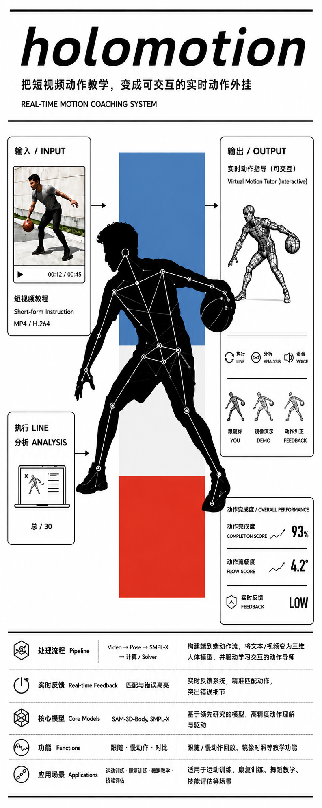
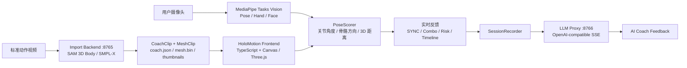

# HoloMotion

> 把一段短视频动作，转成可交互、可跟练、可评分的实时 AI 运动教练。

HoloMotion 是一个面向运动教学、健身跟练和黑客松现场演示的 Web 原型系统。用户可以导入标准动作视频，系统将其转化为 Action DNA、3D 骨骼轨迹与可播放的虚拟教练；练习者打开摄像头后，浏览器端实时提取身体关键点，与标准动作进行逐帧对齐、评分和风险提示，并在训练结束后生成 AI 教练点评。

项目重点不是“播放一个视频”，而是把视频里的动作结构化为可计算的运动序列，让用户能旋转观察、慢放拆解、实时比对，并获得关节级反馈。



## 核心亮点

- **短视频生成虚拟教练**：上传 mp4 / webm 后，后端可通过 SAM 3D Body 生成 `coach.json`、SMPL-X mesh 与逐帧缩略图，前端直接加载为新的动作种子。
- **浏览器端实时姿态估计**：MediaPipe Pose / Hand / Face 资产随仓库离线提供，运行时不依赖 CDN 即可完成本地检测。
- **动作级实时评分**：摄像头采集用户姿态，按关节角度、骨骼方向、3D 距离和动作历史窗口做匹配，输出综合同步分、Combo 与风险关节。
- **可交互 3D 动作舞台**：标准动作在右侧全息舞台中播放，支持 front / side / top 视角、拖拽旋转、滚轮缩放和时间轴 scrub。
- **标定与延迟容忍**：T-pose 标定用于适配不同身高体型；CoachHistory 滑动窗口吸收用户比教练慢半拍的自然反应延迟。
- **AI 教练总结**：训练结束后将 SessionSummary 交给 OpenAI-compatible LLM 代理，流式输出中文动作反馈。
- **前后端解耦**：高频帧进入 `MotionFrameBuffer`，渲染层由 RAF 主动拉取；低频 UI 事件走 `EventBus`，方便替换真实 WebSocket 后端。

## 演示视频

下面的片段来自本地演示录屏，已剪成 720p 级别的 README 预览素材。支持 HTML video 的渲染器可以直接播放；如果 GitHub 页面没有内联播放，点击备用链接即可打开 mp4。

### MLLM 动作分片

<video src="docs/demo/01-mllm-segmentation.mp4" poster="docs/demo/01-mllm-segmentation-poster.png" controls muted playsinline width="100%"></video>

对上传视频做关键帧采样与多模态理解，输出可选择的动作片段。

备用链接：[打开视频](docs/demo/01-mllm-segmentation.mp4)

### 视频上传与 3D 重建

<video src="docs/demo/02-video-to-3d-reconstruction.mp4" poster="docs/demo/02-video-to-3d-reconstruction-poster.png" controls muted playsinline width="100%"></video>

将选中片段送入 SAM 3D Body 导入后端，生成新的 CoachClip / MeshClip 并加入动作种子。

备用链接：[打开视频](docs/demo/02-video-to-3d-reconstruction.mp4)

### 深蹲实时跟练

<video src="docs/demo/03-squat-live-coaching.mp4" poster="docs/demo/03-squat-live-coaching-poster.png" controls muted playsinline width="100%"></video>

展示摄像头跟练、倒计时启动、3D 标准动作、实时 SYNC 分数与动作反馈。

备用链接：[打开视频](docs/demo/03-squat-live-coaching.mp4)

## 系统架构



## 模块状态

| 模块 | 当前状态 |
| --- | --- |
| 前端 UI / 动作舞台 / 时间轴 | 已可演示 |
| MediaPipe Pose / Hand / Face | 已本地离线运行 |
| 视频导入为 CoachClip | 已可用，支持本地视频逐帧处理 |
| SAM 3D Body 导入后端 | 已接入，需要本机模型资产与 Python 环境 |
| 用户标定与实时评分 | 已可用，摄像头开启后参与评分 |
| Session 结果页与 AI 教练 | 已可用，LLM 代理需配置环境变量 |
| WebSocket 外部帧流 | 接口已预留，当前前端可用本地 RealtimeStream / mock 兜底演示 |

## 技术栈

- **Frontend**：TypeScript, native ES modules, Canvas / Three.js, MediaPipe Tasks Vision
- **Motion Runtime**：Quaternion rotation, right-hand coordinate system, meter-based 3D positions
- **Scoring**：MediaPipe world landmarks, pose normalization, joint-angle solver, One-Euro smoothing, history-window matching
- **Import Backend**：FastAPI, ffmpeg, SAM 3D Body, SMPL-X mesh packing
- **LLM Backend**：FastAPI, httpx, OpenAI-compatible `/chat/completions` SSE proxy
- **Build**：Node `stripTypeScriptTypes`，无打包器；`index.html` 直接加载 `dist/main.js`

## 快速开始

### 1. 启动前端

```bash
npm run dev
```

然后打开：

```text
http://localhost:5173
```

`npm run dev` 会先执行构建，再用 Python 静态服务器托管前端。页面默认会连接 `ws://localhost:8000/motion`；如果没有真实 WebSocket 后端，系统仍可使用本地 RealtimeStream / mock 路径完成演示。

### 2. 启动 LLM 代理服务

AI 教练与 MLLM 视频分段通过 `server/` 下的代理服务调用，浏览器不会直接持有模型 API Key。

```bash
npm run server:install
cp .env.example .env
```

编辑 `.env`：

```bash
LLM_BASE_URL=https://your-openai-compatible-endpoint/v1
LLM_API_KEY=your-api-key
LLM_MODEL=your-model
```

启动代理：

```bash
npm run server
```

默认端口为 `8766`，主要端点：

| Method | Path | 用途 |
| --- | --- | --- |
| `GET` | `/api/health` | 检查 LLM 配置 |
| `POST` | `/api/segment` | 视频关键帧分段 |
| `POST` | `/api/chat-stream` | AI 教练流式文本 |

### 3. 启动 SAM 3D Body 导入后端

视频导入服务位于 `backend/`，用于把上传视频转为 HoloMotion 可消费的动作资源。该服务需要本机已准备好 SAM 3D Body、MHR、SMPL-X 相关模型资产。

```bash
# 根据你的 Python / CUDA / 模型路径环境调整
PYTHONPATH=/path/to/sam-3d-body:$(pwd) \
python -m uvicorn backend.app:app --host 0.0.0.0 --port 8765
```

核心端点：

| Method | Path | 用途 |
| --- | --- | --- |
| `GET` | `/healthz` | 检查 SAM 模型加载状态 |
| `GET` | `/import/jobs` | 列出已完成导入任务 |
| `POST` | `/import/video` | 上传视频并生成 CoachClip / MeshClip |

前端默认会访问当前 host 的 `:8765`。如需覆盖导入后端地址，可在 URL 中加入：

```text
http://localhost:5173/?backend=http://localhost:8765
```

## 项目结构

```text
.
├── index.html                 # 浏览器入口，importmap 指向本地 MediaPipe 与 esm.sh Three.js
├── src/                       # TypeScript 源码
│   ├── bootstrap/             # DOM 收集、启动辅助与 mock stream
│   ├── components/            # UI 组件：舞台控制、抽屉、结果页、AI 教练面板
│   ├── core/                  # 动作渲染、摄像头、MediaPipe、评分、导入、LLM 客户端
│   ├── data/                  # 内置动作种子与 pipeline 配置
│   ├── hooks/                 # WebSocket 帧流入口
│   ├── styles/                # 分层 CSS
│   └── types/                 # 前后端共享运动数据契约
├── dist/                      # 构建产物，由 scripts/build.mjs 生成
├── public/
│   ├── mediapipe/             # 离线 WASM / task 模型资产
│   └── coach_clips/           # 预置或导入生成的动作资源
├── backend/                   # SAM 3D Body 视频导入服务
├── server/                    # LLM Proxy Backend
├── sam_3d_body/               # SAM / SMPL-X 转换与导出脚本
├── scripts/                   # 构建与 guardrail 检查
└── docs/                      # 项目文档、视觉参考与后续 demo 视频
```

## 运动数据契约

前后端对齐的核心数据包是 `FRAME_STREAM`。所有 3D 坐标单位均为米，坐标系为右手系，旋转统一使用 `[x, y, z, w]` 四元数。

```json
{
  "type": "FRAME_STREAM",
  "data": {
    "frame": 128,
    "timestampMs": 5333,
    "seedId": "squat",
    "progress": 0.42,
    "score": 87,
    "combo": 8,
    "riskLabel": "Guard knee",
    "globalTransform": {
      "translation": [0, 0, 0],
      "rotation": [0, 0, 0, 1]
    },
    "joints": {
      "pelvis": {
        "position": [0, 0.84, 0.18],
        "rotation": [0, 0, 0, 1]
      }
    },
    "seedJoints": {},
    "localRotations": [[0, 0, 0, 1]],
    "metrics": [
      {
        "id": "knee",
        "name": "knee",
        "score": 87,
        "angleDeltaDeg": 8.4,
        "distanceDeltaCm": 11.2,
        "risk": "warn"
      }
    ]
  }
}
```

约束摘要：

- `joints` 与 `seedJoints` 使用同一组 17 个关节名。
- 摄像头视频镜像显示，3D 教练画布不镜像。
- 高频运动帧只进入 `MotionFrameBuffer`，不进入 UI state。
- `MotionStage` 在 `requestAnimationFrame` 中主动读取最新帧并渲染。
- 切换动作种子必须释放旧资源，避免长时间演示时内存泄漏。

## 质量检查

```bash
npm run check
```

该命令会：

- 重新构建 `dist/`
- 检查坐标系、米制单位、摄像头镜像、RAF 拉取、Quaternion smoothing、资源释放等工程守卫
- 禁止在高频路径中引入 `Euler`、`useState`、`ref(`
- 对所有构建后的 JS 文件执行 `node --check`

## 后续规划

- 接入生产级 WebSocket 帧流服务，替换当前演示兜底路径
- 强化 VFR / UGC 视频的逐物理帧处理
- 将 `MotionFrame` 固化为 OpenAPI / JSON Schema 文档
- 为更多动作类型补充专业评分权重与风险规则
- 增加训练计划、课程内容与多 Session 趋势分析
- 补充 GitHub README demo 视频、答辩短片与产品截图

## 为什么是 HoloMotion

传统运动视频只能“看”，HoloMotion 想把它变成可以计算、可以比较、可以反馈的动作对象。它适合用来展示：

- AI 如何把短视频内容转化为结构化动作数据
- 浏览器端如何完成低延迟姿态估计和实时评分
- 运动教学如何从单向观看升级为交互式训练
- 前端如何在没有重模型实时推理压力的情况下，承接一个可扩展的 3D / AI 体验

HoloMotion 当前仍是原型，但它已经具备完整演示闭环：导入标准动作、生成虚拟教练、开启摄像头跟练、实时评分、结算复盘与 AI 教练反馈。
